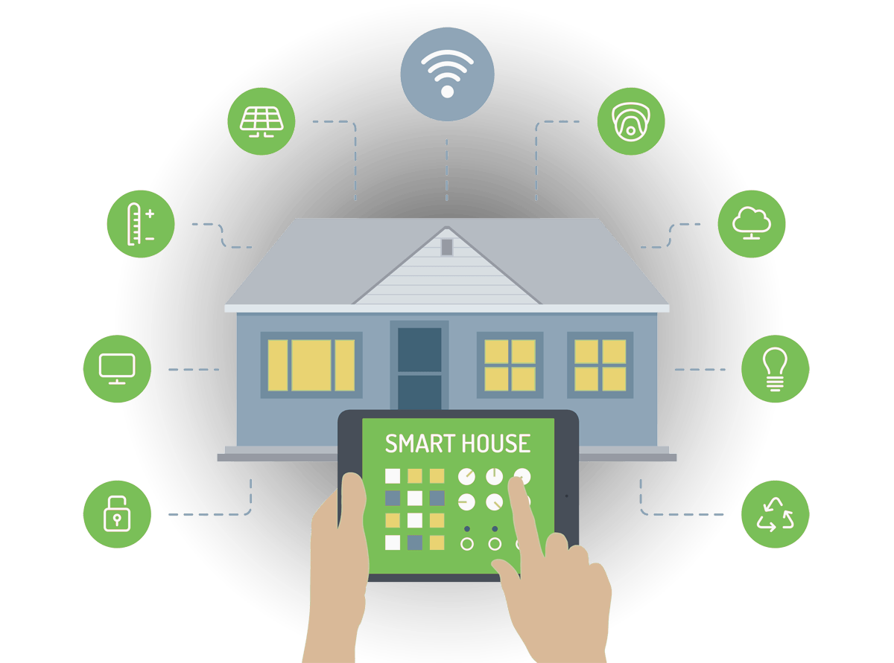

  
  <h1 align="center" style="margin: 0 auto 0 auto;">Smart Home</h1>
  <h5 align="center" style="margin: 0 auto 0 auto;">Control all your smart things in your house</h5>

  
  
  
  
  

  
  
  
  

# We know this is a payment project but consider a donation for do more opensource code and give support to this project!!
This project is not an opensource project. That doesn't mean we don't need any money.
  
Please consider a donation to help us and if we receive enough donations then we can do support for the opensource part of this application.
You can download this app and its over your responsability to maintain this by yourself if you are not our client but if we receive enough donations we can make support for an opensource type.

To donate, please follow this [link](https://ceneka.net/dmtzs).

  

